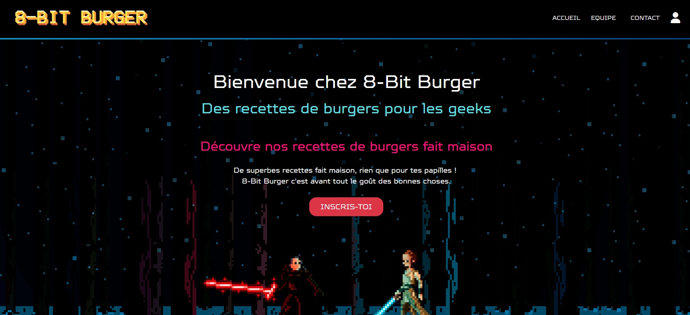

# 8-Bit Burger 🍔

Dans le cadre de la formation de développeur informatique que je réalise actuellement au CESI de Bordeaux, j'ai réalisé avec deux autres étudiants de ma promotion un site internet nommé 8-Bit Burger. Sur fond de thème geek rétro futuriste, le site internet permet aux utilisateurs inscrits de consulter des recettes de hamburgers. Celui-ci possède une architecture MVC en PHP.

Le dépôt final est consultable à partir du compte Github de **Jonathan Zeren** en cliquant <a href="https://github.com/jon-zer-1113/b3" target="_blank" rel="noreferrer">ici</a>.

## Liens du site

Le site internet est accessible à tout visiteur à partir de l'adresse suivante:
- [Accès visiteur](https://8bit-burger.melanieroussy.fr)

L'espace administrateur est accessible à partir de l'adresse suivante:
 - [Accès administrateur](https://8bit-burger.melanieroussy.fr/index.php?p=accueil-admin)

## Fonctionnalités

- **Accès visiteur:** création de compte, consulter des informations relatives aux concept du site et aux créateurs, formulaire de contact.
- **Accès utilisateur:** login, consulter les recettes de hamburgers, laisse des commentaires, imprimer ou télécharger une recette, envoyer une liste de courses par email.
- **Accès administrateur**: création de compte, login, CRUD portant sur les recettes de hamburgers, possibilité de supprimer un compte utilisateur pour le super administrateur.  

## Langages

- **Front-end:** HTML, CSS, JavaScript, SASS (avec API FormSubmit pour l'envoi d'emails, framework CSS Bootstrap, librairie d'icônes Font Awesome)
- **Back-end:** PHP, SQL

## Outils

- **Gestion de projet**: Notion
- **Maquettage**: Adobe XD
- **IDE:** Visual Studio code
- **Modélisation de base de données**: JMerise
- **Serveur local:** WampServer (utilisation de MariaDB et phpMyAdmin)
- **Gestion de version**: Git
- **Client FTP:** Filezilla

</a>&nbsp;&nbsp;&nbsp;&nbsp;&nbsp;&nbsp;&nbsp;&nbsp;&nbsp;&nbsp;&nbsp;&nbsp;<a href="https://www.w3schools.com/css/" target="_blank" rel="noreferrer">&nbsp;&nbsp;</a>&nbsp;&nbsp;

## Collaboration

Compte Github de **Jean-Rafel MENDES**:
- [Jean Rafael MENDES](https://github.com/Rafael3378)  

Compte Github de **Jonathan Zeren**:
- [Jonathan ZEREN](https://github.com/jon-zer-1113)  

## Screenshot

 

 

